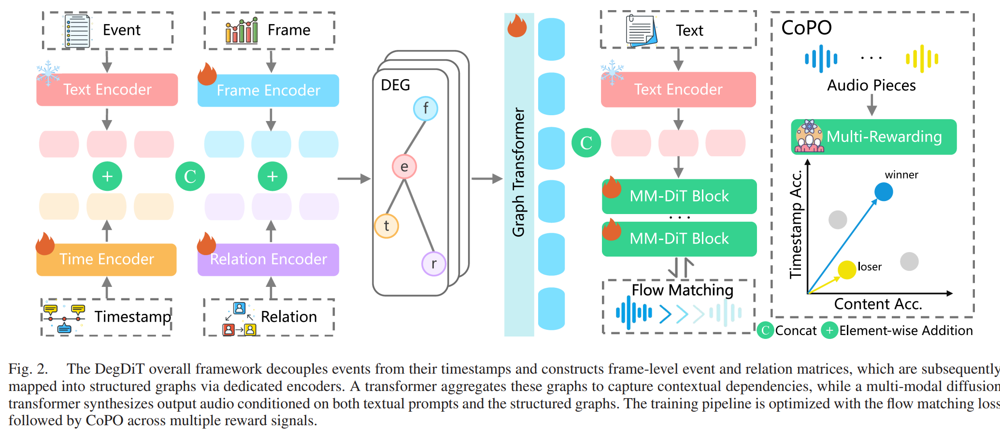
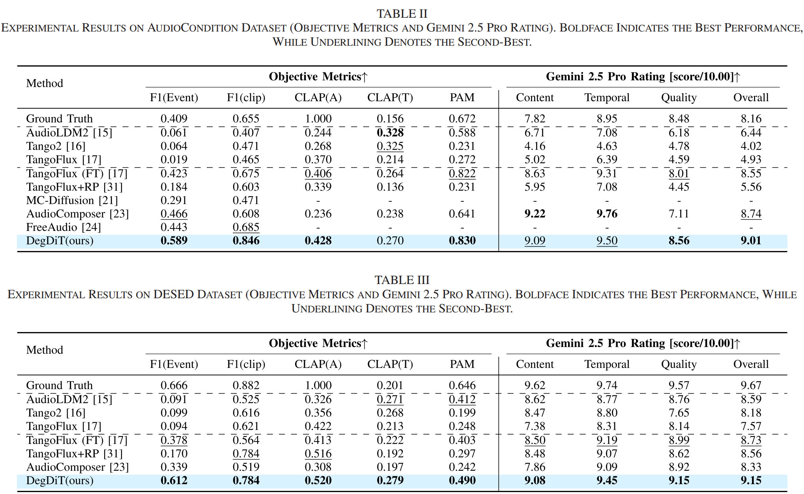
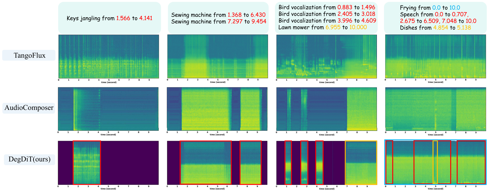

# DegDiT: Controllable Audio Generation with Dynamic Event Graph Guided Diffusion Transformer

<p align="center">
  <a href="https://arxiv.org/abs/2508.13786">
    </a> &ensp;
  <a href="https://riolys.github.io/DegDiT/">
    </a> &ensp;
</p>

---

## 📝 TODO

We are actively working on improving and releasing resources for DegDiT. Stay tuned!

- [✅] 🚀 Release inference code  
- [  ] 📦 Release checkpoints  
- [✅] 🏋️ Release training code  


---

## 📖 Abstract
Controllable text-to-audio generation aims to synthesize audio from textual descriptions while satisfying user-specified constraints, including event types, temporal sequences, and onset and offset timestamps. This enables precise control over both the content and temporal structure of the generated audio. Despite recent progress, existing methods still face inherent trade-offs among accurate temporal localization, open-vocabulary scalability, and practical efficiency. To address these challenges, we propose DegDiT, a novel dynamic event graph-guided diffusion transformer framework for open-vocabulary controllable audio generation. DegDiT encodes the events in the description as structured dynamic graphs. The nodes in each graph are designed to represent three aspects: semantic features, temporal attributes, and inter-event connections. A graph transformer is employed to integrate these nodes and produce contextualized event embeddings that serve as guidance for the diffusion model. To ensure high-quality and diverse training data, we introduce a quality-balanced data selection pipeline that combines hierarchical event annotation with multi-criteria quality scoring, resulting in a curated dataset with semantic diversity. Furthermore, we present consensus preference optimization, facilitating audio generation through consensus among multiple reward signals. Extensive experiments on AudioCondition, DESED, and AudioTime datasets demonstrate that DegDiT achieves state-of-the-art performances across a variety of objective and subjective evaluation metrics.

---

## 📊 Figures

### Figure 1: Overview of DegDiT
<p align="center">
  
</p>


### Figure 2: Experiments on AudioCondition and DESED dataset.
<p align="center">
  
</p>


### Figure 3: Experiments on AudioTime dataset.
<p align="center">
  
</p>


### Figure 4: Case study for Tangoflux, Audiocomposer, and DegDiT.
<p align="center">
  
</p>

---

## 🔗 Citation

If you find this work useful, please cite:

```bibtex
@article{liu2026degdit,
  title={DegDiT: Controllable Audio Generation with Dynamic Event Graph Guided Diffusion Transformer},
  author={Liu, Yisu and Li, Chenxing and Zhang, Wanqian and Wang, Wenfu and Yu, Meng and Fu, Ruibo and Lin, Zheng and Wang, Weiping and Yu, Dong},
  journal={IEEE Transactions on Audio, Speech and Language Processing},
  year={2026},
  publisher={IEEE},
  volume={34},
  pages={1300-1311},
  doi={10.1109/TASLPRO.2026.3663920}
}
